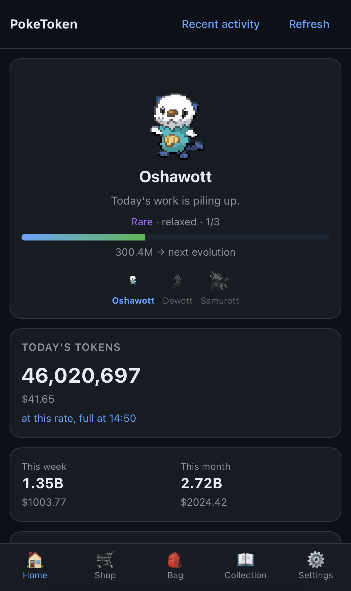

<div align="center">

# PokeTokenWeb

**Your AI coding tokens, hatched into Pokémon — in your browser, on your phone.**

[](https://github.com/sharkusmanch/poketokenweb/actions/workflows/ci.yml)
[](LICENSE)

</div>

PokeTokenWeb turns the tokens you burn in **Claude Code** and **Codex** into a growing
Pokémon companion, served as a self-hosted, mobile-friendly web app. Spend tokens, hatch
an egg, evolve it through its real evolution line, graduate it into your Pokédex, and
start again. Underneath the companion it is a precise usage tracker — today's spend, cost,
and official 5-hour / weekly limits, read straight from your local logs.

<div align="center">

</div>

> Unofficial, non-commercial Pokémon fan project. See [License & disclaimer](#license--disclaimer).

## Credits — this is a derivative work

**All original design, game balance, and the idea belong to
[chattymin/PokeTokenBar](https://github.com/chattymin/PokeTokenBar)**, a macOS menu bar
app. The token economy, evolution pacing, rarity curve, hatch thresholds, shiny odds, and
shop prices are used verbatim because they are tuned values. **If you like this, star the
upstream project.**

The Python engine here began as a fork of
[rubensanchezrivero/poketokenbar-plasma](https://github.com/rubensanchezrivero/poketokenbar-plasma)
(an unofficial Linux/KDE port of the same app), at commit **`54d47a2`**. The git history of
that port is preserved in this repository.

**`poketokenbar/` is now a hard fork.** It was originally kept byte-identical to that
snapshot so upstream fixes could be merged straight in, but that port has had no commits
since, so the discipline bought nothing while blocking behaviour the Swift app had moved on
to. The engine now tracks **chattymin/PokeTokenBar** directly and is ported by hand;
`poketokenweb/` (the HTTP layer) and `web/` (the browser UI) remain this project's own.

## Run it yourself

```bash
curl -O https://raw.githubusercontent.com/sharkusmanch/poketokenweb/main/docker-compose.yml
docker compose up -d
```

Then open <http://localhost:8080>.

### Configuration

Everything is an environment variable; nothing is compiled in.

| Variable | Default | Purpose |
|---|---|---|
| `TZ` | `UTC` | Your local timezone. **Usage is bucketed by local date**, so set this. |
| `HOME` | `/config` | Where the app looks for `.claude/`, `.codex/` and `.claude.json`. |
| `APPRISE_URLS` | *(unset)* | Comma-separated notification URIs. Unset disables notifications. |
| `PORT` | `8080` | HTTP listen port. |
| `POKETOKENWEB_HOST` | `0.0.0.0` | Listen address. This app has **no authentication**; the compose file publishes it on loopback only. |
| `POKETOKENWEB_DATA_DIR` | `/data` | Save, settings, sprite cache, scan cache. |
| `POKETOKENWEB_WEB_ROOT` | `/app/web` | Built frontend assets. |
| `POKETOKENWEB_SPOOL_DIR` | `/tmp/poketokenbar/commands` | UI → daemon command queue. |
| `CLAUDE_CONFIG_DIR` | *(unset)* | Claude **config** dir, if yours is not the default; `projects/` is appended to it. Claude Code defines this name. |
| `POKETOKENWEB_CLAUDE_PROJECT_ROOTS` | *(unset)* | Extra Claude transcript directories to scan, `:`-separated. Each is scanned recursively. In Docker these are paths **inside** the container, so mount them too. |
| `POKETOKENWEB_CODEX_SESSION_ROOTS` | *(unset)* | The same, for Codex rollouts. Deliberately a separate list: a Codex rollout under a Claude root is not a Claude transcript, so the two parsers are never handed the same folder. |
| `POKETOKENWEB_MAX_SPECIES_ID` | `649` | Highest species the companion pool draws from. See [Which Pokémon can hatch](#which-pokémon-can-hatch). |
| `POKETOKENWEB_POKEAPI_BASE_URL` | `https://pokeapi.co/api/v2` | PokéAPI REST base. See [Running your own PokéAPI](#running-your-own-pokéapi). |
| `POKETOKENWEB_POKEAPI_GRAPHQL_URL` | `https://graphql.pokeapi.co/v1beta2` | PokéAPI GraphQL endpoint. Used once, to build the hatch pool. |
| `POKETOKENWEB_SPRITE_BASE_URL` | `.../PokeAPI/sprites/master/sprites` | Root of the sprite repository; species and item art are derived from it. |

### Which Pokémon can hatch

By default the pool is **Gen I–V** (species 1–649, which is 328 evolution-line starts).
That is where the Black/White *animated* sprite set ends — PokéAPI itself serves all nine
generations, so the limit is aesthetic rather than a data one.

To include everything through Gen IX:

```bash
POKETOKENWEB_MAX_SPECIES_ID=1025    # 540 base species instead of 328
```

Two things to know first:

- **Species past 649 have no animated sprite** and fall back to static art, so whether
  your companion animates depends on which one you get.
- **It shifts the odds.** Rarity is weighted by capture rate and the later generations are
  legendary-dense, so the whole curve moves. The pacing was tuned against Gen I–V.

Changing this drops the cached species index so the new range takes effect on the next
poll. Your Pokédex and current companion are untouched.

### Running your own PokéAPI

Species data and sprites are fetched from public services. Both can be repointed at a
[self-hosted PokéAPI](https://github.com/PokeAPI/pokeapi) and a local copy of
[PokeAPI/sprites](https://github.com/PokeAPI/sprites), which is what you want for offline
operation or to stop depending on a service you do not run:

```bash
POKETOKENWEB_POKEAPI_BASE_URL=http://pokeapi.local/api/v2
POKETOKENWEB_POKEAPI_GRAPHQL_URL=http://pokeapi.local/v1beta2
POKETOKENWEB_SPRITE_BASE_URL=http://sprites.local/sprites
```

Each is independent — pointing only the sprites at a local mirror is fine.

- **The three are separate services.** Upstream serves REST and GraphQL from different
  hosts, and sprites from a git repository, so there is no single "PokéAPI URL" to set.
- **A URL that is not absolute `http(s)` is refused** and the default is used instead,
  with a line in the log saying so — a silent fallback to the public API is exactly what
  an offline deployment would never notice.
- **Changing the REST base drops the cached species documents.** Each one embeds an
  absolute evolution-chain URL pointing at whoever served it, so keeping them would send
  the app back to the old host. Sprites are keyed by species id and survive.
- **Remember the egress rules.** If you restrict outbound traffic, the new hosts need to
  be allowed and the old ones no longer do.

### Difficulty

Two independent multipliers in **Settings**, each 10%–200%, both starting at 100% — the
original balance. Growth scales the egg and stage thresholds; shop scales prices. They are
separate on purpose: graded egg prices derive from a *ratio* of the graduation cost, so a
single slider would let "make it grow faster" quietly discount the shop.

Changing growth keeps the **share** of the current egg or stage you have already earned, so
nothing is lost or granted by moving a slider — and a change never hatches, evolves or
graduates anything on its own. Your lifetime tokens, wallet and Pokédex are untouched.

### Notifications

Hatches, evolutions, graduations, shinies and Ditto reveals are pushed through
[Apprise](https://github.com/caronc/apprise), so they can go anywhere it supports:

```bash
APPRISE_URLS=discord://webhook_id/webhook_token
APPRISE_URLS=ntfy://ntfy.sh/your-topic
APPRISE_URLS=pover://user@token
APPRISE_URLS=apprise://your-apprise-server:8000/your-key
APPRISE_URLS=discord://id/token,ntfy://ntfy.sh/topic          # several at once
```

A malformed URI is reported at startup rather than silently never firing.

### File ownership

The image runs as **UID/GID 1000**, the first-user UID on most Linux systems, so a
bind-mounted `~/.claude` is readable out of the box. If your logs are owned by a different
user, set `PUID`/`PGID` in `.env` (see `.env.example`).

## Security

**This application has no authentication of its own.** The compose file binds to
`127.0.0.1` for that reason. If you expose it, put it behind a reverse proxy with auth.

- Your log directories are mounted **read-only** and are never written to.
- The Claude OAuth token is read from `~/.claude/.credentials.json` and sent **only** to
  `api.anthropic.com` to fetch your official limits. It is optional — omit that mount and
  token counts still work; only the limits section disappears.
- Outbound network is limited to: `api.anthropic.com`, `pokeapi.co`,
  `raw.githubusercontent.com` (sprites), the Anthropic/OpenAI status pages, and whatever
  `APPRISE_URLS` points at. The two PokéAPI hosts are configurable — see
  [Running your own PokéAPI](#running-your-own-pokéapi).
- An evolution-chain URL arrives inside a PokéAPI response and is then fetched, so it is
  constrained to the origin of the endpoint actually configured.

## Data sources

| Path | Read for |
|---|---|
| `~/.claude/projects/**/*.jsonl` | Claude Code usage |
| Any dir in `POKETOKENWEB_CLAUDE_PROJECT_ROOTS` | Extra Claude Code usage, scanned recursively (opt-in, unset by default) |
| `~/.codex/sessions/**/*.jsonl` | Codex usage |
| `~/.claude/.credentials.json` | OAuth token for official limits (optional) |
| `~/.claude.json` | Which account those limits belong to (optional) |
| `~/.codex/archived_sessions/**/*.jsonl` | Codex usage from sessions Codex has archived |
| Any dir in `POKETOKENWEB_CODEX_SESSION_ROOTS` | Extra Codex usage, scanned recursively (opt-in, unset by default) |
| [PokéAPI](https://pokeapi.co/) + [PokeAPI/sprites](https://github.com/PokeAPI/sprites) | Species, evolution chains, stats, learnsets, sprites — fetched at runtime, cached, never bundled. Both [configurable](#running-your-own-pokéapi). Learnsets are fetched only when you open a Pokémon's detail page, never by the poll loop. |

## What's missing compared to the macOS app

- **Eleven of the thirteen usage providers.** Only Claude Code and Codex are supported.
  The Linux port never carried Gemini CLI, Antigravity, OpenCode, Hermes, Cursor, Grok,
  Copilot or Kiro, and upstream has since added Pi, omp and Aside. The provider interface
  is unchanged, so each is one file for someone who actually uses it and can verify it.
- Official limits for anything but Claude, and the claude.ai session-key path — a Linux
  container reads `~/.claude/.credentials.json` directly, so it never had the macOS
  Keychain problem that path exists to work around.
- The menu-bar presence and the floating desktop pet — this is a browser tab.
- The game balance assumes one person's coding pace. If your logs include scheduled or
  agent-driven runs, the companion will grow considerably faster than intended — the
  growth [difficulty](#difficulty) slider exists for exactly that.

## Development

```bash
python3 -m venv .venv && .venv/bin/pip install -r requirements.txt pytest
.venv/bin/python -m pytest -q
cd web && npm ci && npm test && npm run build
```

The upstream Swift sources are the specification for game behaviour, and `poketokenbar/`
is ported from them by hand. Where a setting *can* be applied by rebinding a module global
the engine reads at call time, it still is — that is how the PokéAPI endpoints and the
species cap work, and it keeps those knobs out of the engine's own logic.

## License & disclaimer

MIT — see [LICENSE](LICENSE). The MIT licence covers this project's source code only; it
grants no rights to third-party trademarks, artwork, or data.

Pokémon is a trademark of Nintendo / Creatures Inc. / GAME FREAK Inc. This is an
**unofficial, non-commercial fan project** with no affiliation to Nintendo, Game Freak,
Creatures Inc., The Pokémon Company, Anthropic, or OpenAI.

If you are a rights holder with a concern about this project, please open an issue and I
will respond promptly.
